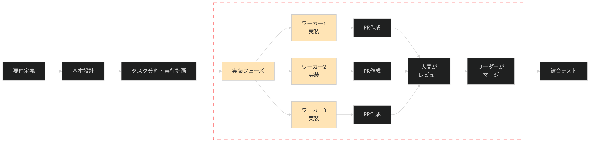
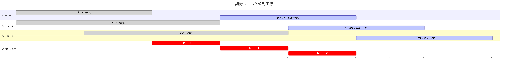

<!-- _paginate: false -->

# AIエージェント並列開発の 失敗体験と学び

 

**AI駆動開発勉強会 沖縄（第2回）**

波平真実（ナミヒラマサミ）

2025/08/26

---

# アジェンダ

1. **自己紹介** - なぜこの話をするか
2. **今回のチャレンジ** - 並列AI開発への挑戦
3. **期待と現実のギャップ** - 想定外の問題
4. **失敗の詳細** - 何が起きたか
5. **改善アプローチ** - 現在の取り組み
6. **学びと教訓** - 得られた知見

---

# 自己紹介

**波平真実（ナミヒラマサミ）**

- **株式会社ZENE** / テックリード（3〜4人の小規模チーム）
- **ゲノム解析ワークフロー・WEBアプリケーション開発**
  - 遺伝子診断システムの構築
  - ゲノム情報 = 要配慮個人情報

**AI駆動開発のモチベーション**
- センシティブな情報を扱うため品質を担保はMust
- その上でAI駆動開発の恩恵を受けて開発速度を上げたい

---

# 並列開発を行おうと思ったキッカケ

## Twitterで話題になっていた並列開発

- tmuxを使った複数エージェント同時実行するツイート
- 各ペインでエージェントがコミュニケーションをとりながら
- タスクを並列に処理する様子を見て面白そうと感じた

**→ 早速試してみることに**

---

# 開発対象

## ToB向け解析レポート進捗管理WEBアプリケーションのプロトタイプ

新規開発予定のプロダクトのプロトタイプ

- **Next.js + AWSサーバレス構成**
- **主要機能**
  - ログイン / アカウント管理
  - 進捗管理
  - レポートファイル管理
  - 監査ログ

<!-- 構成図をここに追加予定 -->

---

# エージェント構成と期待

## エージェント構成
- **リーダー × 1**：オーケストレーション担当
- **ワーカー × 3**：各機能の実装担当

## 期待していた効果
- レビュー中も裏で次の実装が進む並列処理
- きれいに並列で進められる効率的な開発

---

# 開発フローのイメージ

**今回話す内容は並列実装の部分について**

---

# 期待していたこと

- **2-3回のやりとりでタスク完了**
- **待ち時間なしのスムーズな並列実行**
- **レビュー中も他のタスクが進行**

---

# 実際に起きたこと

## 現実は厳しかった

- **ジュニアエンジニア3人分のレビュー地獄**
- 5-10回のやりとりで気力枯渇
- ビッグバンPR（1000行以上）の量産
- **実質的に直列処理に退化**

→ 並列のメリットがほぼ消失

---

# 何が起きたか：記憶喪失による混乱

## コンテキストウィンドウの限界
- 想定より早くコンテキスト上限に到達
- Auto Compactによる記憶喪失が頻発
- 設計と実装にズレが発生

## 連鎖的なカオス
- 後続エージェントが間違った前提で実装
- エラー修正も表面的な対処のみ
- **プロトタイプなのに負債まみれ**

---

# 何が起きたか（続き）

## エージェントの暴走
- スコープクリープ（勝手に機能追加）
- 開発原則を無視（YAGNI、DRY、KISS違反など）
- 同じような処理を重複して定義

## 人間側のボトルネック
- 過度なレビューで精神的に疲弊
- 自分でコードを書いていないので実装を忘れがち
- **ビジネスクリティカルな部分は任せられない**

---

# うまくいった部分もある

## AIが得意な領域
- **UIやデザインは私よりもうまく実装**
- 非コア機能では十分な品質
- 動くものはなんだかんだ速くできる

## 改善の可能性
- E2Eテストを最初に作っておけば品質担保できた
- 非コア機能の実装はDevin等に投げるのもあり

---

# 改善アプローチ（検証中）

## まずは反省
- 直列で十分な品質を担保するワークフローの整備が不十分

## 品質向上のための並列化
- **エージェント間のペアプロ**
- ドメイン/技術スペシャリストで役割分担
- 別コンテキストで記憶喪失を防ぐ

## 人間のボトルネック解消
- 人間の処理能力を基準に並列度を調整
- レビュー要約エージェントの追加

---

# 改善アプローチの効果

## 品質向上のための並列化の結果
- 体感的にコードの品質が向上
- **CodeRabbitや人間によるレビューのやりとりが半減**
- エージェント間の相互チェックが機能
- タスクサイズを適切に保ちPRの肥大化も防止

 

**まだ課題はあるが方向性は正しい**
- 完璧ではないが確実に改善
- 継続的な調整で更なる向上を期待

---

# 得られた教訓

## 期待と現実のギャップ
- 並列開発で単純に速度が上がるわけではない
- コンテキストウィンドウの限界で人が起こさない問題も発生

## 学んだこと
- **まずは直列でフローを整備することが重要**
- 基礎が固まってから並列化へ移行
- 並列化のメリットを引き出す余地はまだある

## 人間の役割は変わらない
- 成果物の責任は結局人間が持つ
- 人間のボトルネックをベースにスケールすべき

---

# まとめ：並列開発の新しい方向性

## 現状うまくいっている並列実行のアプローチ
- 機能別/タスク別の並列ではなく
- **1つのタスクの品質・効率を上げる方向での並列化**
- 品質向上による人間のレビューコストの軽減

## 今後の構想
- まず品質向上のためのエージェント協業を確立
- その後、人間のボトルネックに合わせてスケール
- なるべくコンフリクトしない形で拡張

**失敗から学び、改善を続けています**
