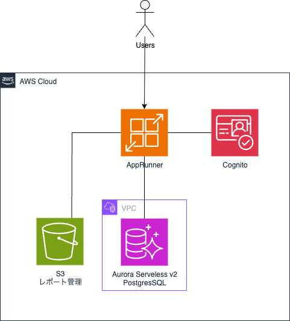
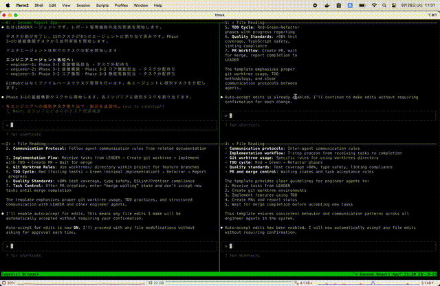
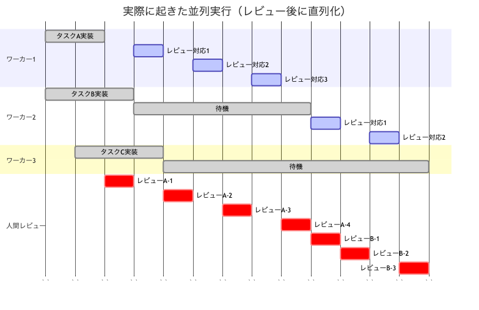

<!-- _class: lead -->
<!-- _paginate: false -->

# AIエージェント並列開発の 失敗体験と学び

 

**AI駆動開発勉強会 沖縄（第2回）**

波平真実（ナミヒラマサミ）

2025/08/26

---

# アジェンダ

1. **自己紹介** - なぜこの話をするか
2. **今回のチャレンジ** - 並列AI開発への挑戦
3. **期待と現実のギャップ** - 想定外の問題
4. **失敗の詳細** - 何が起きたか
5. **改善アプローチ** - 現在の取り組み
6. **学びと教訓** - 得られた知見

---

# 自己紹介

**波平真実（ナミヒラマサミ）**

- **株式会社ZENE** / テックリード（3〜4人の小規模チーム）
- **ゲノム解析ワークフロー・WEBアプリケーション開発**
  - 遺伝子診断システムの構築
  - ゲノム情報 = 要配慮個人情報

**AI駆動開発のモチベーション**
- センシティブな情報を扱うため品質を担保はMust
- その上でAI駆動開発の恩恵を受けて開発速度を上げたい

---

# 並列開発を行おうと思ったキッカケ

## Twitterで話題になっていた並列開発

- tmuxを使った複数エージェント同時実行するツイート
- 各ペインでエージェントがコミュニケーションをとりながら
- タスクを並列に処理する様子を見て面白そうと感じた

**→ 早速試してみることに**

---

# 開発対象

## ToB向け解析レポート進捗管理アプリケーション

新規開発予定のプロダクトのプロトタイプ

- **Next.js + AWSサーバレス構成**
- **主要機能**
  - ログイン / アカウント管理
  - 進捗管理
  - レポートファイル管理
  - 監査ログ

---

# エージェント構成

## エージェント構成
- **リーダー × 1**：オーケストレーション担当
- **ワーカー × 3**：各機能の実装担当
- **利用ツール**：Claude Code + tmux
- **モデル**：Claude 3.5 Sonnet / Claude 3 Opus

---

# 開発フローのイメージ

**今回話す内容は並列実装の部分について**

---

# 期待していたこと

- **2-3回のやりとりでタスク完了**
- **待ち時間なしのスムーズな並列実行**
- **レビュー中も裏で次の実装が進む**
- **きれいに並列で進められる効率的な開発**

---

# 実際に起きたこと

- **暴走を防ぐため並列実行を停止**
  - 明らかにおかしな方針で実装
  - 依存関係が破綻
  - 一つずつ確認しないと危険

- **レビュー疲れで処理が滞留**
  - 複数のPRを同時レビューは困難
  - 結果的に順番に処理

---

# 何が起きたか：記憶喪失による混乱

## コンテキストウィンドウの限界
- 想定より早くコンテキスト上限に到達
- Auto Compactによる記憶喪失が頻発
- 設計と実装にズレが発生

## 連鎖的なカオス
- 後続エージェントが間違った前提で実装
- エラー修正も表面的な対処のみ
- **プロトタイプなのに負債まみれ**

---

# 何が起きたか（続き）

## エージェントの暴走
- スコープクリープ（勝手に機能追加）
- 開発原則を無視（YAGNI、DRY、KISS違反など）
- 同じような処理を重複して定義

## その他の問題
- **レビュー地獄に陥り** 頻繁なやりとりで気力枯渇
- しっかりコードを見れていないので実装を忘れがち
- **ビジネスクリティカルな部分は責任が持てない**

---

# うまくいった部分もある

## 並列でも成功した領域
- **UIやデザインは並列でもうまくいくことが多かった**
  - 一部コード重複があるくらい
- 非コア機能では十分な品質
- 動くものはなんだかんだ速く完成はする

---

# 改善アプローチ

## 反省点
- **直列で十分な品質を担保するフローの整備が不十分**
- 人のコストが高く、そのままでは並列開発はうまくいきそうにない

## 品質向上のための並列化
- **実装エージェントとレビューエージェントのペアプロ**
  - 設計に従って実装 / コーディング規約や整合性をチェック
- 別コンテキストで記憶喪失を防ぐ

**※その他の施策案**
- 人間の処理能力を基準に並列度を調整
- その人の背景に応じたレビュー要約エージェントの追加 など

---

# 改善アプローチの効果

## 品質向上のための並列化の結果
- 体感的にコードの品質が向上
- **CodeRabbitのコメントや人のレビューのやりとりが半減**
- エージェント間の相互チェックが機能
- タスクサイズも適切に保たれPRの肥大化も防止

**まだ課題多いが方向性は良さそう**
- 完璧ではないが確実に改善
- 継続的な調整で更なる向上を期待

---

# 学び

## 並列実行について
- **まずは直列のフローを整備して人間の負荷を下げることが重要**
- 余力を増やして徐々にスケールするとよさそう
- 並列化で工夫する余地はまだまだありそう

## 副次的な学び
- **エージェントをチームとして自律させる試み**
  - AIの普段の使い方にもまだまだ改善の余地があることに気づいた
- **プロセス改善のきっかけ**
  少人数チームのため俗人化しがちだったため、
  各フェーズについてうまく回る仕組みを考える良い機会になった

---

<!-- _class: lead -->
<!-- _paginate: false -->

# ご清聴ありがとうございました

